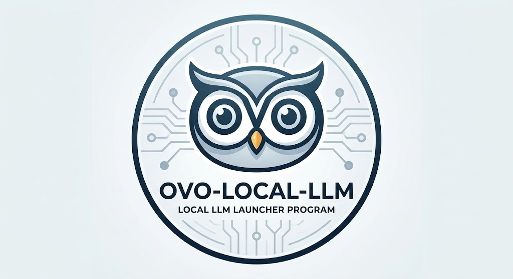
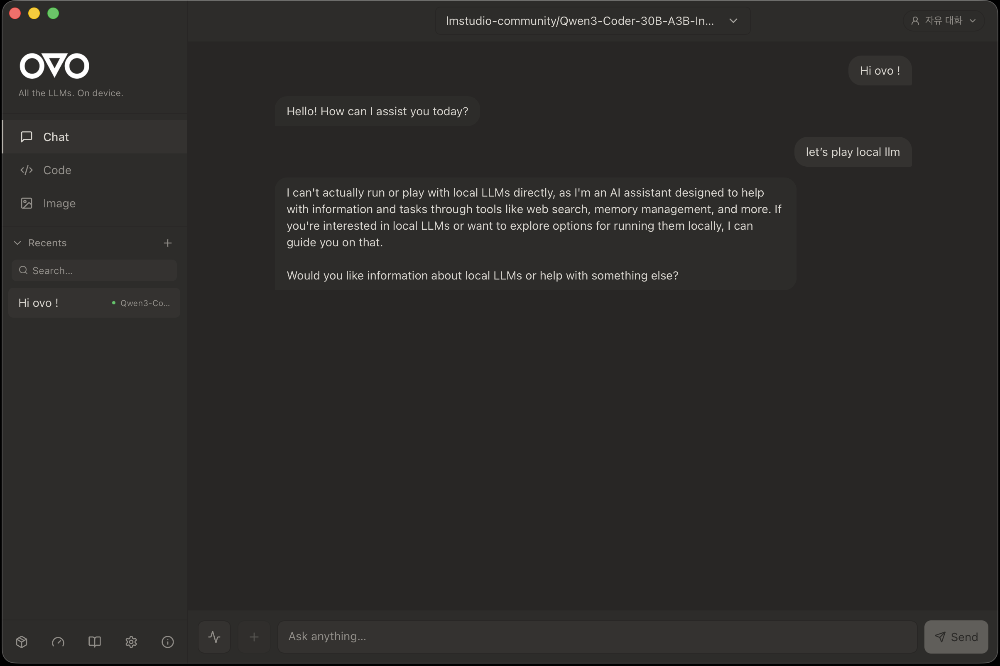
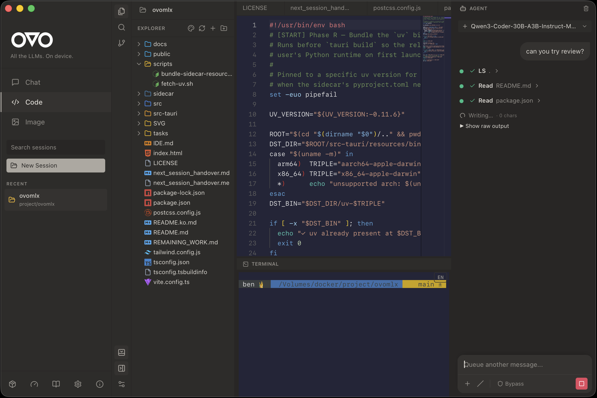
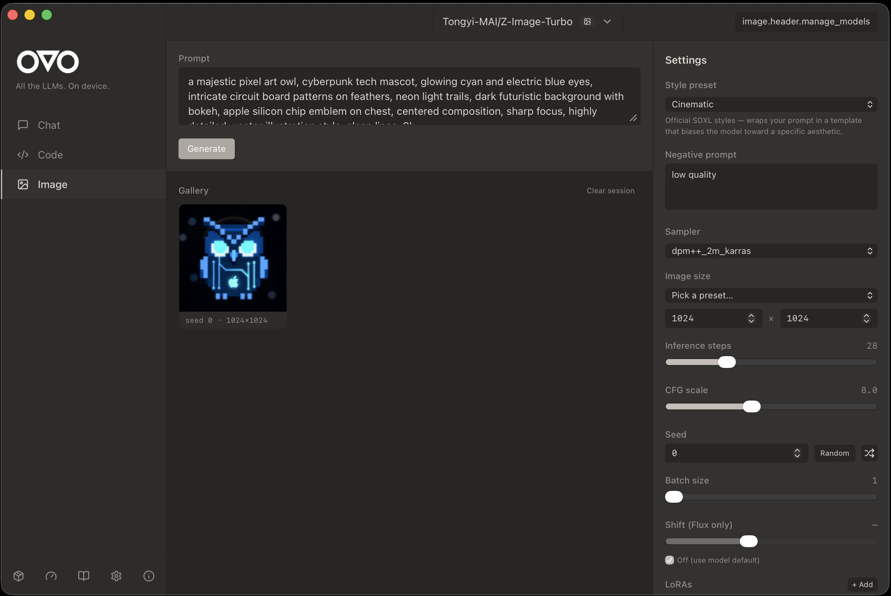
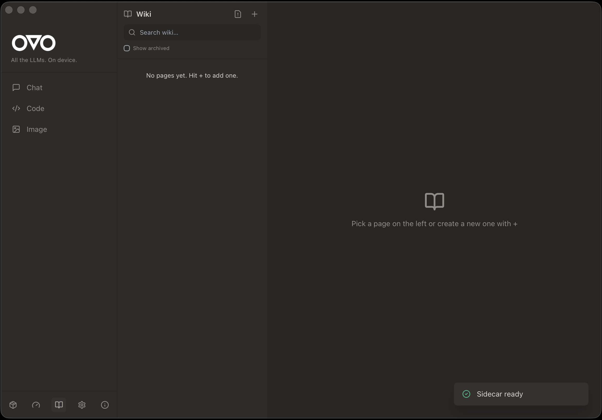
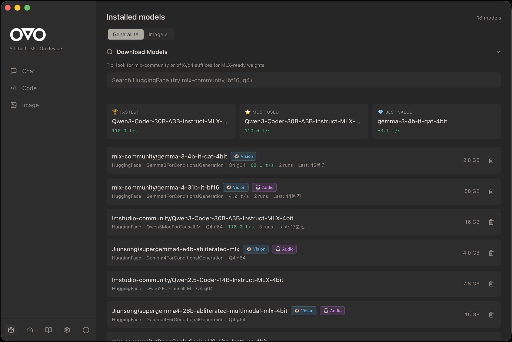
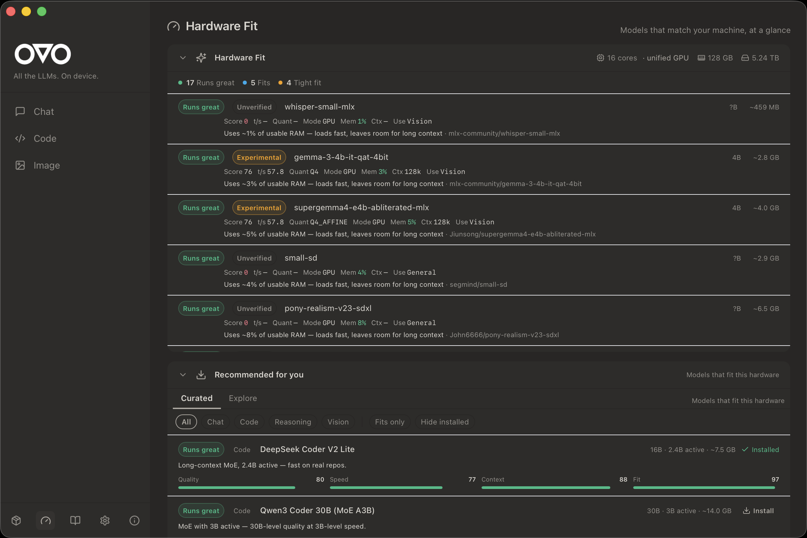
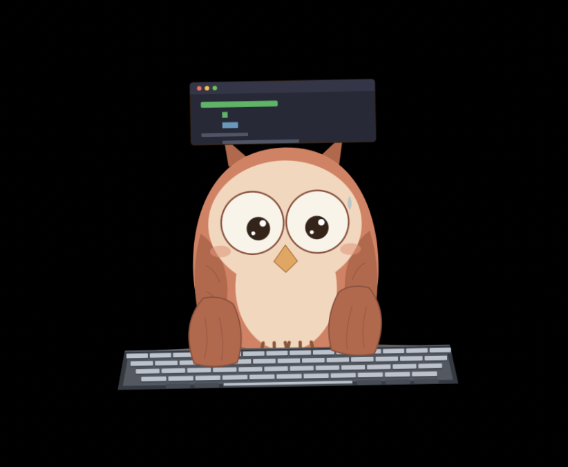
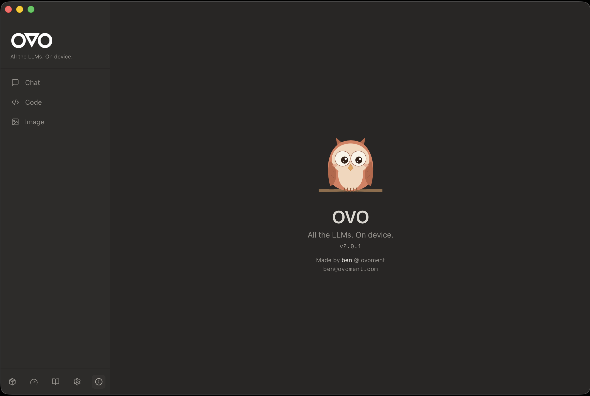

<p align="center">
  
</p>

<p align="center">
  <a href="https://github.com/ovoment/ovo-local-llm/stargazers"></a>
  <a href="https://github.com/ovoment/ovo-local-llm/releases"></a>
  <a href="https://github.com/ovoment/ovo-local-llm/releases/latest"></a>
  <a href="https://github.com/ovoment/ovo-local-llm/issues"></a>
  <a href="https://ko-fi.com/ovoment"></a>
  
  
  
</p>

<h3 align="center">🦉 Local Claude Code for Apple Silicon</h3>

<p align="center">
  AI coding agent + chat + image gen, zero cloud.<br>
  Run every open LLM locally — MLX, Transformers, VLM, Diffusion — with Ollama/OpenAI API compatibility.
</p>

<p align="center">
  <a href="README.ko.md">🇰🇷 한국어 README</a>
</p>

---

<p align="center">
  <video src="https://github.com/user-attachments/assets/71c02f2d-4445-44e8-a2f5-49da064c9e9a" width="860" controls autoplay muted loop>
    Your browser does not support the video tag.
  </video>
</p>

<p align="center">
  
</p>

## ✨ Features at a glance

### 💬 Chat — every open LLM, one interface

Native Ollama/OpenAI API compatibility, streaming responses, session recents, persona switching, file attachments (PDF / Excel / Word / images), voice input + TTS with auto language detection.

### 💻 Code IDE — an agent with hands

<p align="center">
  
</p>

Monaco editor + file explorer + Git panel + PTY terminal + AI inline completion. The Agent Chat on the right gets file read/write/search/exec tools and MCP server integration — it can actually do the work, not just describe it.

### 🖼️ Image generation — diffusion on your laptop

<p align="center">
  
</p>

Local text-to-image via `diffusers`. Sampler / steps / CFG / LoRA controls. Styled presets for the 90% case.

### 📚 Wiki — persistent knowledge across sessions

<p align="center">
  
</p>

Curated notes + auto-captured session logs with BM25 + semantic search. Your local models can query the wiki to stay on-context across restarts.

### 🤖 Models — HuggingFace-native, zero re-downloads

<p align="center">
  
</p>

Auto-detects `~/.cache/huggingface/hub/` + LM Studio cache so models you already have just show up. Tier badges (Supported / Experimental), tok/s benchmarks, vision/audio capability flags.

### 🧭 Hardware fit — pick a model that actually runs

<p align="center">
  
</p>

Scores every model against your RAM / GPU / context headroom. Sorts recommendations by real performance on your machine, not marketing claims.

### 🦉 Desktop mascot

<p align="center">
  
  &nbsp;&nbsp;
  
</p>

An SVG owl that sits on your desktop and reacts to your coding state (idle / thinking / typing / happy). Double-click to summon the main window.

## 📦 Install

1. Download the latest `OVO_x.y.z_aarch64.dmg` from [**Releases**](https://github.com/ovoment/ovo-local-llm/releases).
2. Open the DMG and drag **OVO.app** onto the **Applications** shortcut.
3. Back in the DMG window, double-click **`Install OVO.command`**.
   It shows you exactly the one command it will run, you click **Run**, done.

That's it — no Terminal required.

<details>
<summary>Why the third step? (click to expand)</summary>

OVO's build is not yet signed with an Apple Developer ID (the $99/yr
membership is on the roadmap — see the milestone in [Issues](https://github.com/ovoment/ovo-local-llm/issues)).
Without a signature, macOS flags the app with `com.apple.quarantine` and
refuses to launch it with the classic *"OVO is damaged and can't be opened"*
dialog.

`Install OVO.command` runs a single command to clear that flag:

```bash
xattr -rd com.apple.quarantine /Applications/OVO.app
```

No `sudo`, no network, no background processes. The script is short and
auditable — read it here before running:
[scripts/dmg-templates/Install OVO.command](scripts/dmg-templates/Install%20OVO.command)

</details>

<details>
<summary>Prefer to do it by hand?</summary>

```bash
xattr -rd com.apple.quarantine /Applications/OVO.app
open /Applications/OVO.app
```

If your `/Applications/OVO.app` happens to be owned by `root` (rare on
recent macOS), prefix with `sudo`.

</details>

**First launch** bootstraps a Python runtime into `~/Library/Application Support/com.ovoment.ovo/runtime/` (≈1.5 GB, ~3 min, one-time). Subsequent launches are instant.

### System requirements

- macOS **13+** on Apple Silicon (M1 / M2 / M3 / M4). Intel Macs are not supported.
- **16 GB RAM** minimum (7B models); **32 GB+** recommended for 14B and above.
- **10 GB** free disk for runtime + a couple of models.

## 🚀 Quick start

1. Launch OVO.
2. Go to **Models**, pick a model (Qwen3, Llama 3.3, Gemma, Mistral, DeepSeek, …), click download.
3. Open **Chat** and send a message — the local model answers, no network calls.
4. Open a project folder in **Code** to use the IDE + Agent Chat.

## 🔌 API compatibility

| Flavor | Port | Use case |
|--------|:----:|----------|
| Ollama | `11435` | Drop-in replacement for Ollama clients (Open WebUI, Page Assist, …) |
| OpenAI | `11436` | Point any OpenAI SDK at `http://localhost:11436/v1` |
| Native | `11437` | OVO-specific endpoints — model management, Wiki, streaming, voice |

## 🤝 Claude Code integration (opt-in)

OVO can **read** your local Claude Code config so the same context reaches your local model:

- `CLAUDE.md` — injected as system context
- `.claude/settings.json` — preferences honoured
- `.claude/plugins/**` — behaviour hints

Disabled by default. Flip it on in **Settings → Claude Integration**. OVO never touches claude.ai, API keys, session tokens, or anything that could affect your Claude account.

## 🛠️ Development

```bash
git clone https://github.com/ovoment/ovo-local-llm.git
cd ovo-local-llm

# frontend + Rust deps
npm install

# Python sidecar venv (dev uses $HOME cache, avoids SMB locks)
cd sidecar && uv sync && cd ..

# run the full stack in dev mode
npm run tauri dev
```

Release build: `npm run tauri build` — produces `.app` + `.dmg` under your Cargo target dir.

Deeper docs: [docs/ARCHITECTURE.md](docs/ARCHITECTURE.md) · [docs/ARCHITECTURE.en.md](docs/ARCHITECTURE.en.md) · [docs/release/BUILD.md](docs/release/BUILD.md) · [docs/release/SECURITY.md](docs/release/SECURITY.md) · [docs/release/PRIVACY.md](docs/release/PRIVACY.md)

## 🧱 Architecture

- **Shell** — Tauri 2 (Rust)
- **Frontend** — React 18 + TypeScript + Tailwind + shadcn/ui + Monaco
- **Sidecar** — Python 3.12 FastAPI, spawned by Rust, user-cached venv bootstrapped with a bundled `uv`
- **Runtimes** — `mlx-lm`, `mlx-vlm`, `mlx-whisper`, `transformers`, `diffusers`
- **Storage** — SQLite (chats + Wiki), local filesystem (attachments, models)

## ☕ Support

OVO is a solo-developer project. Every coffee funds one more model architecture I can patch and support.

<p align="center">
  <a href="https://ko-fi.com/ovoment"></a>
</p>

## 📜 License

[MIT](LICENSE) — use it, fork it, ship it.

<p align="center">
  
</p>

<p align="center">
  Made with 🦉 by <a href="https://github.com/ovoment">ben @ ovoment</a>
</p>
